  

  
<h1 align="center">Hi , I'm Alessandro</h1>
<h3 align="center">I'm a Senior Software Architect & Engineer passionate about building scalable ecosystems and high-conversion platforms.</h3>

## 🙋‍♂️ About Me

- 🔭 I’m currently architecting **Enterprise CRMs and complex Data Integrations.**
- 🌱 I’m currently deepening my expertise in **Cloud Infrastructure (AWS) and AI Agents (Groq, LLMs).**
- 👯 I’m looking to collaborate on **High-performance data systems (DuckDB) and Node.js Architecture.**
- 📫 How to reach me **alessandroconectado@gmail.com**
- 🎮 Fun fact **I play CS GO online.**
- 💪 I like to exercise and focus on bodybuilding in my free time.
 

## 🚀 Tech Stack

  

 

## 📊 My Analytics & Insights

  

## Connect with me:

  
  
  

## ❤ Views and Followers

